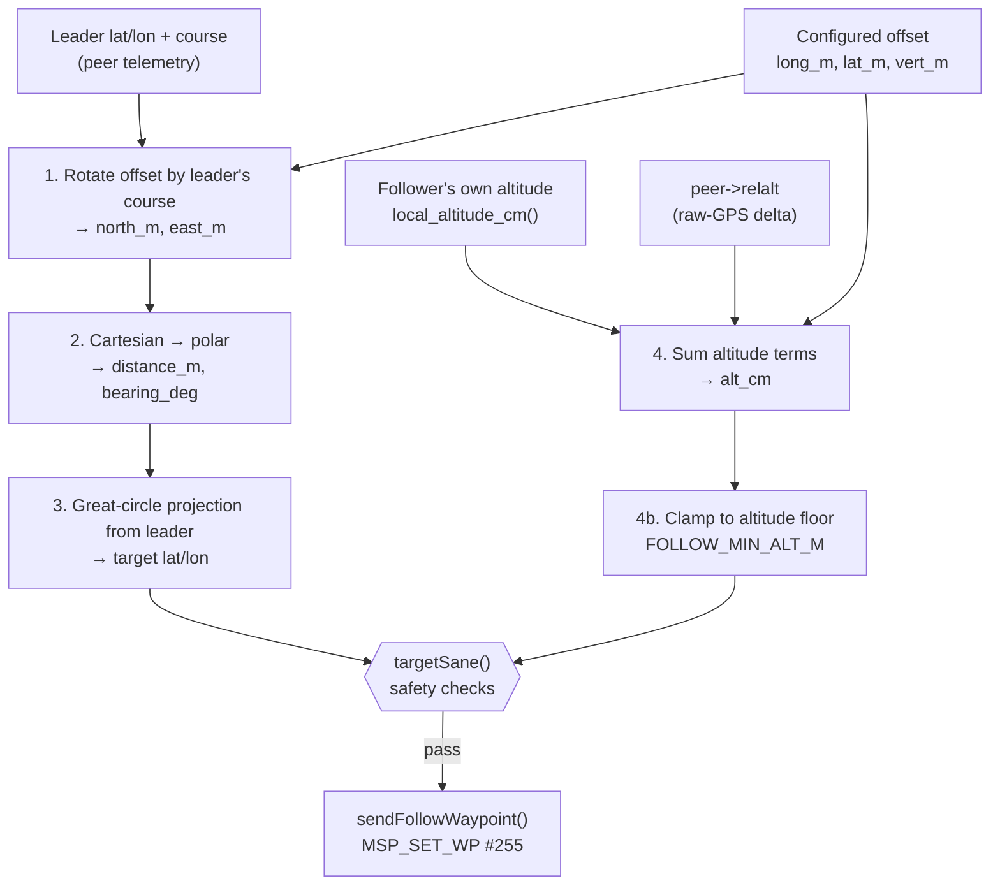

# How the Follower's Target Position Is Calculated

This explains the math behind `slotToLatLon()` (`src/lib/Follow/FollowManager.cpp:12-44`),
the function that turns "leader's GPS position + a configured 3D offset" into
"an absolute lat/lon/altitude to send the follower's flight controller."
It runs every cycle at `FOLLOW_EMIT_HZ` (default 4 Hz, `FollowManager.cpp:246-301`).

There are four steps:

1. Rotate the configured offset from the leader's *track-relative* frame into compass directions (north/east).
2. Convert that north/east offset into a distance and bearing.
3. Project that distance and bearing from the leader's lat/lon onto the sphere to get the target's lat/lon.
4. Compute the target altitude separately, by simple addition.



---

## 1. The offset starts out relative to the leader's heading, not to compass directions

The pilot configures the follower's slot as three signed meter values
(`FollowOffset`, `FollowManager.h:18-22`):

- `longitudinal_m` — positive = ahead of the leader, negative = behind
- `lateral_m` — positive = right of the leader, negative = left
- `vertical_m` — positive = above, negative = below

"Ahead" and "right" only mean something once you know which way the leader
is pointed. A follower configured to sit 15 m *behind* a leader flying due
north needs to end up south of it; the same follower configured *behind* a
leader flying due east needs to end up west of it. So the first step is to
rotate `(longitudinal_m, lateral_m)` by the leader's ground course to get a
`(north_m, east_m)` offset that no longer depends on heading.

This is a standard 2D rotation. Think of it in terms of two unit vectors,
both anchored to the leader's course angle `θ` (measured clockwise from
north, same convention as a compass bearing):

- the **ahead** direction, as a compass vector, is `(cos θ, sin θ)` — north component `cos θ`, east component `sin θ`
- the **right** direction (90° clockwise from ahead) is `(-sin θ, cos θ)`

```
   Track-relative frame                  Compass frame
   (how the offset is configured)        (what the projection needs)

              ahead                                N
                ^                                   ^
                |                                   |
     left <-----+-----> right              W <------+------> E
                |                                   |
                                                     S

                     rotate everything by the leader's course θ
                     (clockwise from north) to go from the left
                     picture to the right one
```

The final north/east offset is just `longitudinal_m` lots of the ahead
vector plus `lateral_m` lots of the right vector:

```
north_m = long_m * cos(θ) - lat_m * sin(θ)      // ahead-unit + right-unit
east_m  = long_m * sin(θ) + lat_m * cos(θ)
```

(`FollowManager.cpp:21-23`, using `course_deg` converted to radians as `θ`)

**Worked check:** leader heading due east (`θ = 90°`), slot configured
"behind, centered" (`long_m = -15, lat_m = 0`):

```
north_m = -15 * cos(90°) - 0 * sin(90°) = -15*0 - 0 =   0
east_m  = -15 * sin(90°) + 0 * cos(90°) = -15*1 + 0 = -15
```

North offset 0, east offset −15 → straight west of the leader. That's
correct: trailing a leader flying east means sitting to its west.

```
   leader flying due EAST (θ = 90°) — "ahead" now points along +E

        target                                       leader
    (15 m "behind")
          ●───────────────── 15 m ─────────────────●────────▶  E
                                                  "ahead" direction
                                                  (course = 90°)

   slot = "behind, centered"  (long_m = -15, lat_m = 0)
   → north_m = 0, east_m = -15  → target sits 15 m due west of the leader
```

## 2. Convert the north/east offset to a distance and bearing

`(north_m, east_m)` is a Cartesian offset. Geographic projection (next
step) wants it in polar form — a straight-line distance and a compass
bearing — so it's converted with the Pythagorean theorem and `atan2`:

```
distance_m  = sqrt(north_m² + east_m²)
bearing_deg = atan2(east_m, north_m)     // atan2(east, north), not (north, east) —
                                          // this makes 0° = north, matching compass bearings
if (bearing_deg < 0) bearing_deg += 360  // atan2 returns [-180°, 180°]; normalize to [0°, 360°)
```

(`FollowManager.cpp:25-30`)

```
                         N (0°)
                         |
                         |
                     target
                         ●
                        /|
                       / |
          distance_m  /  | north_m
                      /   |
                     / θ  |
        leader ●----+-----+---------- E (90°)
                          east_m

   θ = bearing_deg, measured clockwise from north (not to scale)
   distance_m  = sqrt(north_m² + east_m²)   (Pythagorean theorem)
   bearing_deg = atan2(east_m, north_m)     (angle of the leader→target line)
```

Continuing the worked example: `distance_m = sqrt(0² + 15²) = 15`,
`bearing_deg = atan2(-15, 0) = -90° → 270°` — due west, 15 m away. Matches
step 1's sanity check.

## 3. Project that distance + bearing from the leader's position

Now the question is purely geographic: "starting at the leader's lat/lon,
walk `distance_m` meters in compass direction `bearing_deg` — where do you
end up?" This is the classic "direct geodetic problem," solved here by
treating the Earth as a sphere of mean radius `R = 6,371,000 m`
(`GNSSManager::calculatePointAtDistance`, `src/lib/GNSS/GNSSManager.cpp:174-195`,
reused rather than re-implemented — `FollowManager.cpp:36-38`).

```
        target ●╮                              ╭● leader
                 ╲                            ╱
                  ╲      arc length          ╱
                   ╲     = distance_m       ╱
                    ╲                      ╱
                     ╲                    ╱
                      ╲                  ╱
                       ╲                ╱
                        ╲   angular_distance (radians)
                         ╲    = distance_m / R      ╱
                          ╲              ╱
                           ╲            ╱
                            ╲          ╱
                             ╲    ╱
                          Earth's center
                      (radius R = 6,371,000 m)
```

Both points sit on the sphere's surface; `angular_distance` is the angle
between them as measured from the Earth's center. The lat/lon formulas
below solve for where the second point (`lat2`/`lon2`) lands, given the
first point, that angle, and the compass bearing between them.

First, convert the linear distance into an **angular** distance — the angle,
as seen from the Earth's center, subtended by that arc. This is just
arc length ÷ radius, the basic relationship between a circle's radius and
the angle a given arc length sweeps out:

```
angular_distance = distance_m / R          // radians
```

Then the spherical trigonometry for where you land, given a starting
latitude `lat1`, longitude `lon1`, angular distance `d`, and bearing `b`
(all in radians):

```
lat2 = asin( sin(lat1)*cos(d) + cos(lat1)*sin(d)*cos(b) )

lon2 = lon1 + atan2( sin(b)*sin(d)*cos(lat1),
                      cos(d) - sin(lat1)*sin(lat2) )
```

(`GNSSManager.cpp:181-184`)

You don't need to re-derive these to use them — the intuition is that
they're the spherical equivalent of ordinary "sail this far on this
heading" navigation, just done with spherical rather than plane
trigonometry so it stays accurate as bearings and distances get large and
near the poles. For follow-mode's short offsets (tens of meters) a flat
"meters per degree" approximation would give a nearly identical answer, but
the great-circle formula is used because it's already implemented,
proven, and correct at any latitude without a small-angle caveat attached.

The result, `lat2`/`lon2` in degrees, is the target's horizontal position.
It's converted to the fixed-point format INAV's MSP protocol expects
(degrees × 10,000,000, as a 32-bit integer) with a single rounding step at
the end:

```
target.lat_1e7 = round(lat2 * 1e7)
target.lon_1e7 = round(lon2 * 1e7)
```

(`FollowManager.cpp:41-42`)

## 4. Altitude is handled separately — no trigonometry involved

Vertical offset doesn't need rotating or projecting; "above" and "below"
mean the same thing regardless of the leader's heading. The target
altitude is just three numbers added together (`FollowManager.cpp:279-288`):

```
alt_cm = follower's own baro/GPS-fused altitude estimate (cm)
       + peer's reported relative altitude, leader minus follower (cm)
       + configured vertical_m offset (cm)
```

```
   alt_cm
     ^
     |   ┌─────────────────────────┐
     |   │ vertical_m offset       │  configured slot height (× 100 for cm)
     |   ├─────────────────────────┤
     |   │ peer->relalt            │  leader's raw-GPS altitude minus
     |   │ (× 100 for cm)          │  follower's raw-GPS altitude
     |   ├─────────────────────────┤
     |   │ local_altitude_cm()     │  follower's own baro/GPS-fused
     |   │                         │  home-relative estimate
     |   └─────────────────────────┘
     |   0 ─────────────────────────  follower's home altitude
     +───────────────────────────────>
```

The one subtlety: the first term comes from the follower's own flight
controller (baro-fused, generally accurate), while the second comes from
the leader's raw GPS altitude relative to the follower's raw GPS altitude
(no baro fusion, since the leader only broadcasts raw GPS telemetry over
the peer link). Mixing a baro-fused estimate with a raw-GPS delta means the
combined altitude inherits raw GPS's larger vertical error budget — this is
why `FOLLOW_MIN_VSEP_M` (the minimum vertical separation for a "stacked"
slot, `FollowConfig.h:71-73`) is set well above the physical clearance you'd
otherwise pick, to absorb that measurement noise. See spec §6.2/§7.4 for
more detail.

### 4b. The summed altitude is then clamped to an absolute floor

`FOLLOW_MIN_VSEP_M` above only protects the *offset relative to the
leader* — it says nothing about what happens if the leader itself is
flying low, descending, or landing. A follower configured with a `BELOW`
slot, or simply trailing a leader that descends toward the follower's own
home elevation, can end up with a summed `alt_cm` of zero or negative —
i.e. commanded at or below home altitude. That's a flight-into-terrain
risk, so after the three terms above are summed, the result is clamped
(not rejected) to a configurable minimum, `FOLLOW_MIN_ALT_M` (default 3 m,
home-relative; spec §7.6):

```
alt_cm = sum of the three terms above
if (alt_cm < FOLLOW_MIN_ALT_M * 100) {
    alt_cm = FOLLOW_MIN_ALT_M * 100   // floor, not a rejection
}
```

This is a **clamp**, not one of `targetSane()`'s pass/fail checks: the
waypoint still gets emitted, with the follower still tracking the leader's
lateral (lat/lon) position — only the vertical component is overridden to
the floor. Rejecting the waypoint instead (the way `targetSane()` does for
an unsafe horizontal slot) would leave the follower holding its *last*
commanded position indefinitely, which isn't obviously safer than holding
at a known, configured-safe minimum altitude.

```
   alt_cm
     ^
     |   ┌─────────────────────────┐
     |   │ vertical_m offset       │
     |   ├─────────────────────────┤
     |   │ peer->relalt            │  same three terms as step 4 ...
     |   ├─────────────────────────┤
     |   │ local_altitude_cm()     │
     |   └─────────────────────────┘
     |   ┄┄┄┄┄┄┄┄┄┄┄┄┄┄┄┄┄┄┄┄┄┄┄┄┄┄┄  FOLLOW_MIN_ALT_M floor — if the sum
     |                                lands below this line, it's raised
     |                                back up to it before emitting
     |   0 ─────────────────────────  follower's home altitude
     +───────────────────────────────>
```

## Putting it together

For each cycle: rotate the configured offset into a north/east vector using
the leader's current course (step 1) → convert to distance + bearing
(step 2) → walk that distance/bearing from the leader's lat/lon along a
great-circle arc to get the target lat/lon (step 3) → add up altitude
separately (step 4) → clamp the result to the configured altitude floor
(step 4b) → hand `(lat_1e7, lon_1e7, alt_cm)` to
`MSPManager::sendFollowWaypoint()` (`FollowManager.cpp:295`), which packages
it as waypoint #255, INAV's follow-me slot.

Before any of this is sent, `targetSane()` (`FollowManager.cpp:213-244`)
runs some independent safety checks (minimum separation, runtime distance
sanity) — those don't change the math above, they just decide whether to
trust and emit the result.
