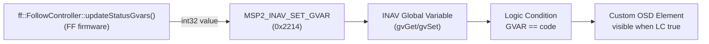

# Showing Follow-Mode Status on the Pilot's OSD (INAV GVAR)

This is the pilot and Configurator side of the Follow status GVAR feature. The
pilot-facing version of the same setup is §6 of
[`docs/user-guide-follow-mode.md`](../user-guide-follow-mode.md); this document
covers the same ground with the INAV CLI field orders spelled out. (The spec and
plan under `docs/spec/` and `docs/plans/` describe the v1-era implementation and
are kept as history.)
FF writes an integer state code into an INAV Global Variable (GVAR) over MSP;
everything from there - turning that number into visible OSD text - happens
entirely on the flight controller, via INAV's **Programming Framework** (Logic
Conditions) and **Custom OSD Elements**. FF does not push text, only numbers.



**Requires INAV 9.0.0 or later on the follower FC.** `MSP2_INAV_SET_GVAR` doesn't
exist before that; FF silently no-ops the writes on older/non-INAV firmware
so this whole setup is inert, not broken, just unused, until
the FC is upgraded.

All CLI snippets below go in INAV Configurator's **CLI** tab (or any serial
terminal attached to the FC's CLI), pasted as a block, followed by `save`.

---

## 0. Pick your two GVAR indices first

INAV has exactly 8 GVAR slots, indices `0`-`7`. FF's *Follow* page has two
dropdowns in its *GVAR* card, *Status GVAR* and *Condition GVAR*, each
`Disabled` or `0`-`7`; over the API they are `statusGvarIndex` and
`conditionFlagsGvarIndex` in `/api/config`'s `follow` block. Whatever you pick
there is what you substitute for the placeholders below. The two must be
different, and must also differ from the autothrottle GVAR indices if you use
those. The UI and the firmware both reject a collision.

Everywhere below, replace:

- `<STATUS_GVAR_INDEX>` with the index you set as **Status GVAR Index** in FF.
- `<CONDITION_FLAGS_GVAR_INDEX>` with the index you set as **Condition Flags
  GVAR Index** in FF.

If a slot is already used by something else on this aircraft (another Logic
Condition setup, a mixer/OSD trick, etc.), pick a free one - FF doesn't care
which indices you use, only that both ends (FF's config and INAV's Logic
Conditions) agree on the same numbers.

You don't need to touch INAV's `gvar` CLI command (which sets a GVAR's default
value and min/max clamp range) - every GVAR defaults to range `-32768..32767`
with default value `0`, which already comfortably covers FF's status codes
(`0`-`4`).

---

## 1. Primary lock-state indicator (`statusGvarIndex`)

FF writes one of these codes to `<STATUS_GVAR_INDEX>` every cycle, resending an
unchanged value at least every 5 s so that one dropped write cannot leave the
OSD stale forever:

| Code | Meaning | Example OSD text |
|---|---|---|
| `0` | Follow gate inactive, nothing to show | *(no element visible)* |
| `1` | `ACQUIRING`, searching for a leader | `SEARCHING` |
| `2` | `LOCKED`, tracking normally | `LOCKED` |
| `3` | `LOCKED_HOLDING`, leader telemetry stale or lost, holding position | `HOLD LOST` |

There is no code `4`. v1 had one for "this peer id now belongs to a different
aircraft", which cannot happen in v2: peers are keyed by a 32-bit UID, and a
UID belongs to one piece of hardware.

Code `0` intentionally has no visible element, which is what keeps the OSD
clean on flights where you never engage follow mode. So you need three Logic
Conditions and three Custom OSD elements, one pair per nonzero code.

A Custom OSD element's visibility can only be gated on a single value match
(`GVAR == 0`, effectively "GVAR is truthy") *or* a Logic Condition's result -
not "GVAR equals this specific number" directly. So each state needs a small
**Logic Condition** that evaluates `<STATUS_GVAR_INDEX> == code`, and a
**Custom OSD Element** whose visibility points at that Logic Condition.

### 1a. Logic Conditions (one per code)

```
logic 0 1 -1 1 5 <STATUS_GVAR_INDEX> 0 1 0
logic 1 1 -1 1 5 <STATUS_GVAR_INDEX> 0 2 0
logic 2 1 -1 1 5 <STATUS_GVAR_INDEX> 0 3 0
```

Field order (`logic <index> <enabled> <activatorId> <operation> <operandA
type> <operandA value> <operandB type> <operandB value> <flags>`):
`operation 1` = Equal; `operandA type 5` = "read this GVAR", `operandA value`
= the GVAR index; `operandB type 0` = "literal value", `operandB value` = the
code being matched; `activatorId -1` = always active, no prerequisite;
`flags 0` = none needed.

This example uses Logic Condition slots `0`-`2`. INAV has 64 slots (`0`-`63`),
so if those are already used for something else on this aircraft, use free
slots instead and adjust the Custom OSD elements below to point at whichever
slots you actually used.

### 1b. Custom OSD elements (one per code, bound to the matching Logic Condition)

```
osd_custom_elements 0 1 0 0 0 0 0 2 0 "SEARCHING"
osd_custom_elements 1 1 0 0 0 0 0 2 1 "LOCKED"
osd_custom_elements 2 1 0 0 0 0 0 2 2 "HOLD LOST"
```

Field order (`osd_custom_elements <index> <part0 type> <part0 value> <part1
type> <part1 value> <part2 type> <part2 value> <visibility type> <visibility
value> "<text>"`): each element has three content "parts" (text/icon/number
slots) - here only part 0 is used, `type 1` = static text, which comes from
the quoted string, so `part0 value 0` is a don't-care. `visibility type 2` =
gated on a Logic Condition; `visibility value` = which Logic Condition index
(matching 1a's slots `0`-`3`). Text is capped at 16 characters and is
auto-uppercased by INAV regardless of case typed here. The strings above are
illustrative: edit them to whatever you want, as long as they fit.

This uses Custom OSD Element slots `0`-`2` (INAV has 8, `0`-`7`), with the same
"reuse free slots" caveat as the Logic Conditions above.

### 1c. Place the elements on screen

`osd_custom_elements` only *defines* the elements - it doesn't position them.
Positioning (which OSD layout, which screen column/row, whether visible in
that layout) is exactly like any other OSD element (altitude, GPS speed,
etc.). The simplest and least error-prone way to do this is Configurator's
**OSD** tab: the three elements you just created will appear in the item list
as `CUSTOM ELEMENT 1`-`3`; drag each onto the OSD preview where you want it.
(There is a CLI equivalent, `osd_layout`, but its item-index numbering spans
*all* OSD elements, not just custom ones, and shifts between INAV versions -
not worth hand-computing when the Configurator tab does this safely.)

---

## 2. Condition indicator (`conditionFlagsGvarIndex`)

The condition GVAR is a sequential code, not a bitmask. When several conditions
are true in the same cycle, the highest value wins:

| Code | Meaning | Example OSD text |
|---|---|---|
| `0` | No condition active | *(no element visible)* |
| `1` | Commanded altitude is being clamped to the configured floor | `ALT FLOOR` |
| `2` | Solved target is farther than `maxTargetDistM` from the follower, so nothing is emitted | `TOO FAR` |
| `3` | RC-driven slot is frozen, or the RC pre-arm check failed | `BAD RC` |

If all you want is "something is going on", one element gated directly on the
GVAR's truthiness does it, with no Logic Condition at all:

```
osd_custom_elements 3 1 0 0 0 0 0 1 <CONDITION_FLAGS_GVAR_INDEX> "FF COND"
```

`visibility type 1` = gated on a GVAR being nonzero; `visibility value` = the
GVAR index itself, not a Logic Condition index.

To tell the three apart, give each its own Logic Condition and element, exactly
as in §1a and §1b:

```
logic 3 1 -1 1 5 <CONDITION_FLAGS_GVAR_INDEX> 0 1 0
logic 4 1 -1 1 5 <CONDITION_FLAGS_GVAR_INDEX> 0 2 0
logic 5 1 -1 1 5 <CONDITION_FLAGS_GVAR_INDEX> 0 3 0
osd_custom_elements 3 1 0 0 0 0 0 2 3 "ALT FLOOR"
osd_custom_elements 4 1 0 0 0 0 0 2 4 "TOO FAR"
osd_custom_elements 5 1 0 0 0 0 0 2 5 "BAD RC"
```

These elements are independent of §1's: a condition can show alongside
`LOCKED`, alongside `HOLD LOST`, or on its own with the gate inactive, because
FF writes the condition code from what happened this cycle rather than from the
lock state. Code `2` in particular only arises while a lock is held, and code
`3` is reported even with the gate off, since the RC pre-arm check runs
whenever the aircraft is disarmed.

Place them on screen the same way as §1c.

A single combined element that only shows when, say, `LOCKED` *and*
altitude-clamped are both true needs one more Logic Condition (`operation 7`,
AND, combining the two) feeding a further Custom OSD element. Not covered here,
since standalone indicators carry the same information with less wiring.

---

## 3. Save and verify

```
save
```

Then, per element:

1. **Confirm the GVAR itself updates.** With FF connected and follow mode
   engaged, open Configurator's **Programming** tab (Global Variables
   section) and watch `<STATUS_GVAR_INDEX>` / `<CONDITION_FLAGS_GVAR_INDEX>`
   change as you drive the follow state. Cross-check against FF's
   `GET /api/status`, whose `follow.status_gvar` and `follow.condition_gvar`
   report the values it last sent. Both are *absent* until a value has been
   published, which is not the same as reading `0`, because `0` is itself a
   real value.
2. **Confirm the OSD text follows it.** With the FC's OSD feed in
   Configurator (or goggles/monitor), each state should show its element and
   only its element. No two should ever be visible at once for the primary
   indicator, since the three Logic Conditions are mutually exclusive by
   construction, as the underlying lock states are.
3. **Confirm the "nothing" state is actually clean.** With the follow gate
   off, none of the primary elements should be visible. That is code `0`, which
   deliberately has no matching Logic Condition (§1). A condition element can
   legitimately still show with the gate off: an RC pre-arm failure is reported
   there.

On a bench, FF's traffic simulator is the easiest way to drive all of these
states on demand. See
[`bench-testing-follow-mode.md`](bench-testing-follow-mode.md).

---

## Reference: full command block

Everything from §1 and §2 in one paste-able block (still needs
`<STATUS_GVAR_INDEX>` / `<CONDITION_FLAGS_GVAR_INDEX>` substituted, and
`save` at the end, and the OSD-tab placement step from §1c/§2 - those parts
can't be scripted from the CLI):

```
logic 0 1 -1 1 5 <STATUS_GVAR_INDEX> 0 1 0
logic 1 1 -1 1 5 <STATUS_GVAR_INDEX> 0 2 0
logic 2 1 -1 1 5 <STATUS_GVAR_INDEX> 0 3 0
logic 3 1 -1 1 5 <CONDITION_FLAGS_GVAR_INDEX> 0 1 0
logic 4 1 -1 1 5 <CONDITION_FLAGS_GVAR_INDEX> 0 2 0
logic 5 1 -1 1 5 <CONDITION_FLAGS_GVAR_INDEX> 0 3 0
osd_custom_elements 0 1 0 0 0 0 0 2 0 "SEARCHING"
osd_custom_elements 1 1 0 0 0 0 0 2 1 "LOCKED"
osd_custom_elements 2 1 0 0 0 0 0 2 2 "HOLD LOST"
osd_custom_elements 3 1 0 0 0 0 0 2 3 "ALT FLOOR"
osd_custom_elements 4 1 0 0 0 0 0 2 4 "TOO FAR"
osd_custom_elements 5 1 0 0 0 0 0 2 5 "BAD RC"
save
```

---

## Sources

Verified directly against INAV's `master` branch source (not just the docs,
which are thinner on exact CLI syntax than the code):

- `src/main/fc/cli.c` - `processCliLogic()` (the `logic` command's field order
  and validation ranges) and the `osd_custom_elements` handler (its field
  order and validation ranges).
- `src/main/programming/logic_condition.h` - `logicOperation_e` (operation
  codes, e.g. `LOGIC_CONDITION_EQUAL = 1`) and `logicOperandType_e` (operand
  type codes, e.g. `LOGIC_CONDITION_OPERAND_TYPE_GVAR = 5`).
- `src/main/io/osd/custom_elements.h` / `.c` - `osdCustomElementType_e` (part
  type codes, e.g. `CUSTOM_ELEMENT_TYPE_TEXT = 1`),
  `osdCustomElementTypeVisibility_e` (visibility type codes), and
  `isCustomelementVisible()` (confirms `CUSTOM_ELEMENT_VISIBILITY_GV` means
  "GVAR is nonzero," not "GVAR equals a specific configured value" - why §1
  needs Logic Conditions but §2 doesn't).
- `src/main/programming/global_variables.c` - `gvSet()`'s clamp range
  (confirms the default `-32768..32767` per-GVAR range needs no `gvar` CLI
  adjustment for FF's `0`-`4` codes).
