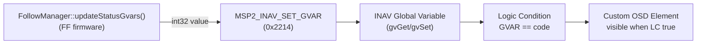

# Showing Follow-Mode Status on the Pilot's OSD (INAV GVAR)

This is the pilot/Configurator-side half of the Follow-Status-OSD-GVAR feature
(spec: [`docs/spec/2026-08-13-FollowStatusOsdGvar.md`](../spec/2026-08-13-FollowStatusOsdGvar.md),
plan: [`docs/plans/2026-08-13-FollowStatusOsdGvar-Plan.md`](../plans/2026-08-13-FollowStatusOsdGvar-Plan.md)).
FF writes an integer state code into an INAV Global Variable (GVAR) over MSP;
everything from there — turning that number into visible OSD text — happens
entirely on the flight controller, via INAV's **Programming Framework** (Logic
Conditions) and **Custom OSD Elements**. FF does not push text, only numbers.



**Requires INAV 9.0.0 or later on the follower FC.** `MSP2_INAV_SET_GVAR` doesn't
exist before that; FF silently no-ops the writes on older/non-INAV firmware
(spec §2.2), so this whole setup is inert — not broken, just unused — until
the FC is upgraded.

All CLI snippets below go in INAV Configurator's **CLI** tab (or any serial
terminal attached to the FC's CLI), pasted as a block, followed by `save`.

---

## 0. Pick your two GVAR indices first

INAV has exactly 8 GVAR slots, indices `0`-`7`. FF's web UI (`/followmanager/config`
panel in `follow.js`) has two dropdowns — **Status GVAR Index** and **Condition
Flags GVAR Index** — each `Disabled` or `0`-`7`. Whatever you pick there is
what you substitute for the placeholders below. **The two must be different**
(the UI blocks picking the same non-disabled index for both).

Everywhere below, replace:

- `<STATUS_GVAR_INDEX>` with the index you set as **Status GVAR Index** in FF.
- `<CONDITION_FLAGS_GVAR_INDEX>` with the index you set as **Condition Flags
  GVAR Index** in FF.

If a slot is already used by something else on this aircraft (another Logic
Condition setup, a mixer/OSD trick, etc.), pick a free one — FF doesn't care
which indices you use, only that both ends (FF's config and INAV's Logic
Conditions) agree on the same numbers.

You don't need to touch INAV's `gvar` CLI command (which sets a GVAR's default
value and min/max clamp range) — every GVAR defaults to range `-32768..32767`
with default value `0`, which already comfortably covers FF's status codes
(`0`-`4`).

---

## 1. Primary lock-state indicator (`statusGvarIndex`)

FF writes one of these codes to `<STATUS_GVAR_INDEX>` every cycle (spec §3):

| Code | Meaning | Example OSD text |
|---|---|---|
| `0` | Follow gate inactive — nothing to show | *(no element visible)* |
| `1` | `ACQUIRING` — searching for a leader | `SEARCHING` |
| `2` | `LOCKED` — tracking normally | `LOCKED` |
| `3` | `LOCKED_HOLDING` — leader telemetry stale/lost, holding position | `HOLD LOST` |
| `4` | Peer identity mismatch caught — lock invalidated, needs a switch cycle | `ID LOST` |

Code `0` intentionally has no visible element (spec §3.1) — that's what keeps
the OSD clean on flights where you never engage follow mode. So you only need
four Logic Conditions and four Custom OSD elements, one pair per nonzero code.

A Custom OSD element's visibility can only be gated on a single value match
(`GVAR == 0`, effectively "GVAR is truthy") *or* a Logic Condition's result —
not "GVAR equals this specific number" directly. So each state needs a small
**Logic Condition** that evaluates `<STATUS_GVAR_INDEX> == code`, and a
**Custom OSD Element** whose visibility points at that Logic Condition.

### 1a. Logic Conditions (one per code)

```
logic 0 1 -1 1 5 <STATUS_GVAR_INDEX> 0 1 0
logic 1 1 -1 1 5 <STATUS_GVAR_INDEX> 0 2 0
logic 2 1 -1 1 5 <STATUS_GVAR_INDEX> 0 3 0
logic 3 1 -1 1 5 <STATUS_GVAR_INDEX> 0 4 0
```

Field order (`logic <index> <enabled> <activatorId> <operation> <operandA
type> <operandA value> <operandB type> <operandB value> <flags>`):
`operation 1` = Equal; `operandA type 5` = "read this GVAR", `operandA value`
= the GVAR index; `operandB type 0` = "literal value", `operandB value` = the
code being matched; `activatorId -1` = always active, no prerequisite;
`flags 0` = none needed.

This example uses Logic Condition slots `0`-`3`. INAV has 64 slots (`0`-`63`)
— if `0`-`3` are already used for something else on this aircraft, use free
slots instead and adjust the Custom OSD elements below to point at whichever
slots you actually used.

### 1b. Custom OSD elements (one per code, bound to the matching Logic Condition)

```
osd_custom_elements 0 1 0 0 0 0 0 2 0 "SEARCHING"
osd_custom_elements 1 1 0 0 0 0 0 2 1 "LOCKED"
osd_custom_elements 2 1 0 0 0 0 0 2 2 "HOLD LOST"
osd_custom_elements 3 1 0 0 0 0 0 2 3 "ID LOST"
```

Field order (`osd_custom_elements <index> <part0 type> <part0 value> <part1
type> <part1 value> <part2 type> <part2 value> <visibility type> <visibility
value> "<text>"`): each element has three content "parts" (text/icon/number
slots) — here only part 0 is used, `type 1` = static text, which comes from
the quoted string, so `part0 value 0` is a don't-care. `visibility type 2` =
gated on a Logic Condition; `visibility value` = which Logic Condition index
(matching 1a's slots `0`-`3`). Text is capped at 16 characters and is
auto-uppercased by INAV regardless of case typed here — the strings above are
just illustrative, edit them to whatever you want, as long as they fit.

This uses Custom OSD Element slots `0`-`3` (INAV has 8, `0`-`7`) — same
"reuse free slots" caveat as the Logic Conditions above if you already have
custom elements configured for something else.

### 1c. Place the elements on screen

`osd_custom_elements` only *defines* the elements — it doesn't position them.
Positioning (which OSD layout, which screen column/row, whether visible in
that layout) is exactly like any other OSD element (altitude, GPS speed,
etc.). The simplest and least error-prone way to do this is Configurator's
**OSD** tab: the four elements you just created will appear in the item list
as `CUSTOM ELEMENT 1`-`4`; drag each onto the OSD preview where you want it.
(There is a CLI equivalent, `osd_layout`, but its item-index numbering spans
*all* OSD elements, not just custom ones, and shifts between INAV versions —
not worth hand-computing when the Configurator tab does this safely.)

---

## 2. Altitude-floor indicator (`conditionFlagsGvarIndex`)

This is simpler: FF writes `1` to `<CONDITION_FLAGS_GVAR_INDEX>` exactly while
the commanded altitude is being clamped to the configured safety floor
(parent spec §7.6), and `0` otherwise (spec §3.2). Since that's already a
plain boolean (nonzero = show), you don't need a Logic Condition at all —
Custom OSD Elements support gating visibility directly on "this GVAR is
nonzero":

```
osd_custom_elements 4 1 0 0 0 0 0 1 <CONDITION_FLAGS_GVAR_INDEX> "ALT FLOOR"
```

`visibility type 1` = gated directly on a GVAR's truthiness (visible whenever
`gvGet(<CONDITION_FLAGS_GVAR_INDEX>) != 0`); `visibility value` = the GVAR
index itself, not a Logic Condition index. This element is independent of
§1 — it can show alongside `LOCKED`, alongside `HOLD LOST`, or (in principle)
even alongside `SEARCHING`, since FF writes it based on the altitude clamp
decision each cycle, not on lock state (see the plan's `floorClamped`
parameter to `updateStatusGvars()`).

Place it on screen the same way as §1c (Configurator's OSD tab, `CUSTOM
ELEMENT 5`).

If you later want a single combined element that only shows when, say,
`LOCKED` *and* altitude-clamped are both true at once, that needs one more
Logic Condition (`operation 7`, AND, combining Logic Condition `1` from §1a
with a new `<CONDITION_FLAGS_GVAR_INDEX> == 1` Logic Condition) feeding a
sixth Custom OSD element — not covered here, since a standalone indicator
covers the same information without the extra wiring.

---

## 3. Save and verify

```
save
```

Then, per element:

1. **Confirm the GVAR itself updates.** With FF connected and follow mode
   engaged, open Configurator's **Programming** tab (Global Variables
   section) and watch `<STATUS_GVAR_INDEX>` / `<CONDITION_FLAGS_GVAR_INDEX>`
   change as you drive the follow state (or cross-check against FF's
   `/followmanager/status` endpoint, which reports the same values it last
   sent as `statusGvarValue` / `conditionFlagsGvarValue`, added specifically
   as a bench-test debug aid — see the plan's Work Item 2).
2. **Confirm the OSD text follows it.** With the FC's OSD feed in
   Configurator (or goggles/monitor), each state should show its element and
   only its element — no two should ever be visible at once for the primary
   indicator, since the four Logic Conditions are mutually exclusive by
   construction (the underlying lock states are).
3. **Confirm the "nothing" state is actually clean.** With the follow gate
   off, none of the four primary elements (and not the altitude-floor one)
   should be visible — that's code `0`, which deliberately has no matching
   Logic Condition (§1).

---

## Reference: full command block

Everything from §1 and §2 in one paste-able block (still needs
`<STATUS_GVAR_INDEX>` / `<CONDITION_FLAGS_GVAR_INDEX>` substituted, and
`save` at the end, and the OSD-tab placement step from §1c/§2 — those parts
can't be scripted from the CLI):

```
logic 0 1 -1 1 5 <STATUS_GVAR_INDEX> 0 1 0
logic 1 1 -1 1 5 <STATUS_GVAR_INDEX> 0 2 0
logic 2 1 -1 1 5 <STATUS_GVAR_INDEX> 0 3 0
logic 3 1 -1 1 5 <STATUS_GVAR_INDEX> 0 4 0
osd_custom_elements 0 1 0 0 0 0 0 2 0 "SEARCHING"
osd_custom_elements 1 1 0 0 0 0 0 2 1 "LOCKED"
osd_custom_elements 2 1 0 0 0 0 0 2 2 "HOLD LOST"
osd_custom_elements 3 1 0 0 0 0 0 2 3 "ID LOST"
osd_custom_elements 4 1 0 0 0 0 0 1 <CONDITION_FLAGS_GVAR_INDEX> "ALT FLOOR"
save
```

---

## Sources

Verified directly against INAV's `master` branch source (not just the docs,
which are thinner on exact CLI syntax than the code):

- `src/main/fc/cli.c` — `processCliLogic()` (the `logic` command's field order
  and validation ranges) and the `osd_custom_elements` handler (its field
  order and validation ranges).
- `src/main/programming/logic_condition.h` — `logicOperation_e` (operation
  codes, e.g. `LOGIC_CONDITION_EQUAL = 1`) and `logicOperandType_e` (operand
  type codes, e.g. `LOGIC_CONDITION_OPERAND_TYPE_GVAR = 5`).
- `src/main/io/osd/custom_elements.h` / `.c` — `osdCustomElementType_e` (part
  type codes, e.g. `CUSTOM_ELEMENT_TYPE_TEXT = 1`),
  `osdCustomElementTypeVisibility_e` (visibility type codes), and
  `isCustomelementVisible()` (confirms `CUSTOM_ELEMENT_VISIBILITY_GV` means
  "GVAR is nonzero," not "GVAR equals a specific configured value" — why §1
  needs Logic Conditions but §2 doesn't).
- `src/main/programming/global_variables.c` — `gvSet()`'s clamp range
  (confirms the default `-32768..32767` per-GVAR range needs no `gvar` CLI
  adjustment for FF's `0`-`4` codes).
