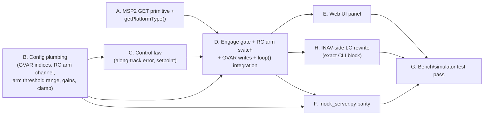

# FormationFlight — Follow-Mode Speed Autothrottle (INAV GVAR) — Implementation Plan

**Spec:** [`docs/spec/2026-08-28-FollowSpeedAutothrottle.md`](../spec/2026-08-28-FollowSpeedAutothrottle.md)
**Depends on:**
- [`2026-07-31-FollowMeOnInav-Plan.md`](2026-07-31-FollowMeOnInav-Plan.md) — `PeerLock`, the position-waypoint stream, and the `/peermanager/spoof` + hexagon-patrol bench tooling this plan's tests reuse throughout.
- [`2026-08-13-FollowStatusOsdGvar-Plan.md`](2026-08-13-FollowStatusOsdGvar-Plan.md) — `MSPManager::sendGvar()` (already shipped, reused as-is — no changes needed here), the `gvarIndexOptions`/collision-guard pattern in `html/follow.js`, and the GVAR-index `applyConfig()` validation style this plan's config work item copies verbatim.

**Status:** Draft for review

---

## Finding during planning (not in the spec — a real gap, not a nit)

Spec §2.4 assumes `MSPManager` can query `MSP2_INAV_MIXER` the same way `getFCVariant()`/`getFCVersion()` already query MSP1 messages via `MSP::request()`. Checked against the actual `MSP` class (`src/lib/MSP/MSP.h:714-754`, `src/lib/MSP/MSP.cpp`):

- `MSP::request(uint8_t messageID, ...)` (`MSP.cpp:236-240`) is `send(id, NULL, 0); return waitFor(id, payload, maxSize, recvSize);` — **MSP v1 only** (`uint8_t` message ID).
- The only MSP v2 send path already in use, `MSP::command2()` (`MSP.cpp:255-262`), is `send2(id, payload, size); return waitFor2(id, NULL, 0);` — it **discards the reply payload** (`waitFor2(id, NULL, 0)`). It's built for *sending a command and waiting for a content-less ack* (`MSPManager::sendGvar()`'s use case), not for reading a v2 reply's contents.
- `MSP::send2()`/`waitFor2()`/`recv2()` all already exist as building blocks (`MSP.h:726-734`), but nothing in this codebase currently composes them into a "send a v2 request, read its reply" primitive — there's no v2 equivalent of `request()` yet, because nothing has ever needed to *read* an MSP2 GET-style reply before now.

So work item **A** below adds one new low-level primitive, `MSP::request2()`, mirroring `request()` exactly but through the v2 send/wait pair. This is a small, self-contained addition to the generic `MSP` class (not `MSPManager`), and everything else in this feature builds on it.

## Second finding: min/max speed must not also live in the INAV script (and sink-rate protection is deferred, not replaced)

The reference script bakes two speed-flavored literals directly into its Logic Conditions: `LC20`'s `BASE_TARGET_CMS` (a baseline/cruise target) and `LC36`'s `110` (the pilot-trim knob's max range, in km/h). Neither is reachable via MSP — Logic Conditions are configured as opaque `logic <id> <enabled> <activator> <op> <operandAType> <operandA> <operandBType> <operandB> <flags>` lines with no per-field getter, so unlike `platformType` or `navConfig()->general.max_auto_speed` (both real MSP-readable INAV settings considered and rejected for other reasons during spec review), there's no way for FF to read or write these two literals even if it wanted to. If they're left in place, a pilot now has **two** independently-edited definitions of "how fast should this plane go" — FF's `minTargetSpeedMps`/`maxTargetSpeedMps` and whatever's sitting in `LC20`/`LC36` — with no mechanism to keep them in sync and no way for either side to detect drift.

The resolution (spec §1.4/§6, revised after discussion): **delete** `LC20`-`LC38` outright rather than leave them "disconnected." Sink-rate/stall protection is **deferred to a later phase, not moved into FF this iteration** — an earlier draft of this plan reimplemented it in FF's control law reading the follower's vertical speed via a new `MSPManager` getter; that's been dropped from phase 1 (spec §1.4). The mitigation for now is a documentation/UI change instead of new code: `minTargetSpeedMps`'s field description tells the pilot to set it with a real margin above the airframe's actual stall speed (roughly a third above stall, spec §3.5), so the clamp floor that already exists for other reasons absorbs what a reactive sink-rate correction would otherwise have handled.

This plan also adds a pilot-assigned RC arm switch, `autothrottleEnableRcChannel` (spec §3.2), read by FF the same way `rcLongChannel`/`rcLatChannel`/`rcVertChannel` are already read — this is what lets a pilot run auto-follow with autothrottle switched off independent of the two GVAR indices being configured. This is a bigger change than the original plan draft (work items **B**/**D** below are revised accordingly, work item **C** is simpler than originally drafted since it no longer touches `MSPManager` at all, and work item **H** replaces what would have been a "wire it up" appendix with an actual from-scratch LC rewrite).

One PID-config detail flagged for bench verification during this second pass: `programming/pid.c`'s setpoint/measurement resolution calls the same generic `logicConditionGetOperandValue(type, value)` function regular Logic Conditions use for their operands — which strongly implies (but wasn't confirmed against a running INAV instance) that a PID's `measurementType` can be `2` (`FLIGHT`) to read ground speed directly, skipping the original script's `GVAR1`/`LC4`/`LC50` passthrough machinery entirely. Work item **H** below documents both the direct-`FLIGHT` wiring and a documented `GVAR1`-passthrough fallback, in case a given INAV build doesn't accept it — the accompanying open question in the spec (§7) should be closed once this is bench-verified either way.

---

## Design summary — dependency graph

Eight work items. Edges are "must land and be verified before the arrow's target can be built or meaningfully tested" — not file-touch order. Each node has its own bench checkpoint that doesn't require the nodes after it; nothing is tested for the first time only once the whole feature is wired together.



Practical read: **A** and **B** have no dependencies on each other or on anything new — start both immediately, in parallel if two people are working this. **C** only needs **B**'s new tuning fields to exist, and — since sink-rate protection is deferred (spec §1.4) — no longer touches `MSPManager` at all, just `FollowManager`'s own geometry/setpoint math. **D** is the integration point — it needs the platform check (**A**), the tuning config and RC arm channel (**B**), and the setpoint math (**C**) all landed, plus its own new RC-switch read for the arm gate. **E** (UI), **F** (mock server), and **H** (the actual INAV CLI rewrite) all need **D**'s new status/wire contract to exist before they have anything real to bind to, mirror, or point at. **G** is the only step that needs real INAV firmware (bench FC or SITL) rather than the spoofed-peer/mock-server tooling everything before it uses — it's also where **H**'s CLI block actually gets pasted in and exercised for the first time.

---

## A. MSP2 GET primitive + airframe query

Depends on: nothing. Fully testable standalone, no `FollowManager` involvement.

**`src/lib/MSP/MSP.h`** (class `MSP`, alongside `request()` at line 736):
```cpp
// Like request(), but for MSP v2 messages: sends a no-payload v2 request
// and waits for the matching v2 reply. Needed because command2() (used by
// sendGvar()) discards its reply payload — command2()'s job is "send and
// ack," this one's job is "send and read the answer" (see this plan's
// finding-during-planning note).
bool request2(uint16_t messageID, void * payload, uint8_t maxSize, uint8_t * recvSize = NULL);
```

**`src/lib/MSP/MSP.cpp`** (next to `request()`):
```cpp
bool MSP::request2(uint16_t messageID, void * payload, uint8_t maxSize, uint8_t * recvSize)
{
  send2(messageID, NULL, 0);
  return waitFor2(messageID, payload, maxSize, recvSize);
}
```

**`src/lib/MSP/MSP.h`** (near the other MSP2 defines, `MSP.h:79-86`):
```cpp
#define MSP2_INAV_MIXER 0x2010 // GET mixer config incl. platformType (INAV 1.9+, MSP API 2.1+)
```
And near `msp_set_gvar_t` (`MSP.h:684-693`, spec §2.4):
```cpp
// MSP2_INAV_MIXER reply. Verified against inav/src/main/fc/fc_msp.c's
// MSP2_INAV_MIXER case: motorDirectionInverted, a reserved byte, then
// motorstopOnLow, platformType, hasFlaps, appliedMixerPreset (u16),
// MAX_SUPPORTED_MOTORS, MAX_SUPPORTED_SERVOS, in that order — 9 bytes total.
struct msp_mixer_config_t {
  uint8_t  motorDirectionInverted;
  uint8_t  reserved;
  uint8_t  motorstopOnLow;
  uint8_t  platformType;
  uint8_t  hasFlaps;
  uint16_t appliedMixerPreset;
  uint8_t  maxSupportedMotors;
  uint8_t  maxSupportedServos;
} __attribute__ ((packed));

// mixerConfig()->platformType values (INAV's flyingPlatformType_e).
enum InavPlatformType {
    INAV_PLATFORM_MULTIROTOR = 0,
    INAV_PLATFORM_AIRPLANE   = 1,
    INAV_PLATFORM_HELICOPTER = 2,
    INAV_PLATFORM_TRICOPTER  = 3,
    INAV_PLATFORM_ROVER      = 4,
    INAV_PLATFORM_BOAT       = 5,
};
```

**`src/lib/MSP/MSPManager.h`** (public, near `getFCVariant()`):
```cpp
// Returns the connected FC's mixer platform type (MSP2_INAV_MIXER, spec
// docs/spec/2026-08-28-FollowSpeedAutothrottle.md §2.4). Cached once per
// connection like getFCVariant(); defaults to INAV_PLATFORM_MULTIROTOR
// (the least permissive answer) until a real reply is received, so an
// unanswered/pre-connection query fails closed rather than open.
InavPlatformType getPlatformType();
```

**`src/lib/MSP/MSPManager.cpp`** (next to `getFCVariant()`, `MSPManager.cpp:87-125`, same cache-once-per-connection shape):
```cpp
InavPlatformType MSPManager::getPlatformType()
{
    static msp_mixer_config_t mixer{};
    static bool cached = false;
    if (sys.phase > MODE_HOST_SCAN)
    {
        cached = true;
    }
    if (!cached && ready && getFCVariant() == HOST_INAV)
    {
        if (msp->request2(MSP2_INAV_MIXER, &mixer, sizeof(mixer)))
        {
            cached = true;
        }
    }
    return (InavPlatformType)mixer.platformType; // 0 == INAV_PLATFORM_MULTIROTOR if never populated
}
```
Note this reads `getFCVariant()` for the host check but doesn't try to distinguish "not INAV" from "INAV but not yet answered" — both correctly fall through to the same fail-closed `INAV_PLATFORM_MULTIROTOR` default.

*Test (bench, no FollowManager wiring at all):* temporarily add a `DBGF("[MSPManager] platformType=%d\n", getPlatformType());` call inside `MSPManager::loop()` (or a one-off call from `main.cpp::setup()`'s bench log path — implementer's choice, remove either before merging into D below). Connect a bench INAV FC (or SITL) configured with an airplane mixer, confirm the serial log prints `1`. Reconfigure the same FC to a quadcopter mixer via INAV Configurator, reboot FF's connection (or the FC), confirm it prints `0`. This is the one node in the whole plan that needs real INAV firmware to test, but it's a two-minute check against a single MSP query — no follow-mode logic involved yet.

---

## B. Config plumbing

Depends on: nothing (parallel to A).

**`src/lib/Follow/FollowConfig.h`** (new `#ifndef` block, alongside the existing GVAR-index/RC-channel defaults):
```cpp
#ifndef FOLLOW_TARGET_SPEED_GVAR_INDEX
#define FOLLOW_TARGET_SPEED_GVAR_INDEX -1
#endif
#ifndef FOLLOW_AUTOTHROTTLE_ENGAGE_GVAR_INDEX
#define FOLLOW_AUTOTHROTTLE_ENGAGE_GVAR_INDEX -1
#endif
#ifndef FOLLOW_AUTOTHROTTLE_ENABLE_RC_CHANNEL
#define FOLLOW_AUTOTHROTTLE_ENABLE_RC_CHANNEL -1   // -1 = unassigned, always armed (spec §3.2)
#endif
#ifndef FOLLOW_AUTOTHROTTLE_ENABLE_MIN_THRESHOLD_US
#define FOLLOW_AUTOTHROTTLE_ENABLE_MIN_THRESHOLD_US 1700   // armed-range floor, spec §7 open question
#endif
#ifndef FOLLOW_AUTOTHROTTLE_ENABLE_MAX_THRESHOLD_US
#define FOLLOW_AUTOTHROTTLE_ENABLE_MAX_THRESHOLD_US 2100   // armed-range ceiling, spec §7 open question
#endif
#ifndef FOLLOW_SPEED_CORRECTION_KP
#define FOLLOW_SPEED_CORRECTION_KP 0   // 0 = feedforward-only until bench-tuned (spec §7)
#endif
#ifndef FOLLOW_MIN_TARGET_SPEED_MPS
#define FOLLOW_MIN_TARGET_SPEED_MPS 5.0
#endif
#ifndef FOLLOW_MAX_TARGET_SPEED_MPS
#define FOLLOW_MAX_TARGET_SPEED_MPS 30.0
#endif
```
(Placeholder defaults — spec §7 explicitly leaves final tuning to bench-testing; these just need to be *safe and inert* at compile time, not correct for any specific airframe. `Kp=0` means the feature is a pure feedforward mirror of leader speed until a pilot dials in correction gain. `FOLLOW_MIN_TARGET_SPEED_MPS`'s default carries extra weight this iteration (spec §1.4) since there's no reactive sink-rate correction — it, and the "set it comfortably above stall" UI copy that goes with it, are the feature's entire stall-safety story until a later phase revisits reactive protection. `FOLLOW_AUTOTHROTTLE_ENABLE_MIN_THRESHOLD_US`/`_MAX_THRESHOLD_US`'s `1700`/`2100` are placeholder armed-range bounds — this codebase has no prior 2-position-switch convention to copy, per spec §7. Making both ends of the range pilot-configurable, rather than hardcoding a single switch-high threshold, is what lets the same field pair express a plain 2-way switch (wide range covering the whole high half), a 3-way switch (a narrow range around one specific middle/high position), or a 6-pos switch (a narrow range around one specific detent) — the pilot picks the sub-range of stick travel that means "armed" for whatever switch they've actually bound, FF no longer assumes a 2-position switch shape.)

**`src/lib/Follow/FollowManager.h`**
- `FollowRuntimeConfig`: add the eight fields (`int16_t targetSpeedGvarIndex`, `int16_t autothrottleEngageGvarIndex`, `int16_t autothrottleEnableRcChannel`, `int16_t autothrottleEnableMinThresholdUs`, `int16_t autothrottleEnableMaxThresholdUs`, `int16_t speedCorrectionKp`, `double minTargetSpeedMps`, `double maxTargetSpeedMps`), seeded from the new defines — same style as the existing `statusGvarIndex`/`rcLongChannel` blocks immediately above them.
- `FollowEepromRecord`: add the matching eight fields (`int16_t` throughout, including the two `double` RAM fields per the struct's existing `lround()`-narrowing convention). Bump `FOLLOW_EEPROM_VERSION` 4 → 5 (plain reset-to-defaults for anyone with an existing saved record, same accepted consequence as the 2→3 bump `2026-08-13`'s plan already took) — one bump covers all eight new fields together, no need for a second one.

**`src/lib/Follow/FollowManager.cpp`**
- `applyConfig()` (`FollowManager.cpp:803-885`): add, alongside the existing `statusGvarIndex`/`conditionFlagsGvarIndex`/`rcLongChannel` checks —
  ```cpp
  if (newConfig.targetSpeedGvarIndex < -1 || newConfig.targetSpeedGvarIndex > 7)
  {
      *errMsg = "targetSpeedGvarIndex must be -1 (disabled) or 0-7";
      return false;
  }
  if (newConfig.autothrottleEngageGvarIndex < -1 || newConfig.autothrottleEngageGvarIndex > 7)
  {
      *errMsg = "autothrottleEngageGvarIndex must be -1 (disabled) or 0-7";
      return false;
  }
  if (newConfig.autothrottleEnableRcChannel != -1 &&
      (newConfig.autothrottleEnableRcChannel < 1 || newConfig.autothrottleEnableRcChannel > MSP_MAX_SUPPORTED_CHANNELS))
  {
      *errMsg = "autothrottleEnableRcChannel must be -1 (disabled) or 1-16";
      return false;
  }
  if (newConfig.maxTargetSpeedMps <= newConfig.minTargetSpeedMps || newConfig.minTargetSpeedMps < 0)
  {
      *errMsg = "maxTargetSpeedMps must be > minTargetSpeedMps >= 0";
      return false;
  }
  ```
  (The `autothrottleEnableRcChannel` check is copied verbatim from the existing `rcLongChannel` check, `FollowManager.cpp:848`. `autothrottleEnableMinThresholdUs`/`autothrottleEnableMaxThresholdUs` deliberately get **no** min-vs-max ordering check here — the user asked for that comparison to live only in the web UI (E below) as an advisory check, not as a hard `applyConfig()` rejection; see `F`'s note on why the mock server follows suit.)
- `configJson()` (`FollowManager.cpp:765-801`): add the eight fields, same `(*doc)["x"] = config.x;` style.
- `toEepromRecord()`/`fromEepromRecord()` (`FollowManager.cpp:893-960`): add straight-through copies for the six `int16_t` fields and `lround()`-narrowed copies for the two `double` fields (mirrors `minCourseSpeed`'s existing handling exactly).

**`src/lib/WiFi/WiFiManager.cpp`** — `handleFollowManagerConfigPost()` (`WiFiManager.cpp:319-363`): add the eight `hasParam`/`toInt()`/`toDouble()` lines alongside the existing GVAR/RC ones.

*Test (bench, no FC needed):* `GET /followmanager/config`, confirm the eight new fields appear with their compile-time defaults (`autothrottleEnableMinThresholdUs=1700`, `autothrottleEnableMaxThresholdUs=2100`). `POST` new values, confirm `GET` reflects them and `applyConfig()`'s new validation actually rejects an inverted/negative clamp (`minTargetSpeedMps=20, maxTargetSpeedMps=10` → 400), an out-of-range RC channel (`autothrottleEnableRcChannel=17` → 400), and an out-of-range GVAR index (`targetSpeedGvarIndex=9` → 400). Confirm `applyConfig()` does **not** reject an inverted threshold pair (`autothrottleEnableMinThresholdUs=2100, autothrottleEnableMaxThresholdUs=1700` → 200, accepted) — that ordering check is UI-only, per this node's design note above. Save to EEPROM, reboot (or power-cycle), confirm all eight values survive — and separately confirm a unit still running the old `FOLLOW_EEPROM_VERSION == 4` layout comes up on compile-time defaults rather than a garbled read, the documented consequence of the version bump.

---

## C. Control law

Depends on: **B** (needs `speedCorrectionKp`/`minTargetSpeedMps`/`maxTargetSpeedMps` to exist). No `MSPManager` changes — sink-rate protection is deferred to a later phase (spec §1.4), so this node no longer needs `MSP_ALTITUDE`/vertical-speed telemetry at all.

**`src/lib/Follow/FollowManager.h`** (private, next to `resolveCourseDeg()`/`resolveHeadingDeg()`):
```cpp
// Signed along-track distance (meters) from the follower's current position
// to `target`, in the leader's track frame (spec §4.2) — positive means the
// target is ahead of the follower (follower is lagging its slot).
double resolveAlongTrackErrorM(const FollowTarget &target, double courseDeg) const;

// Combines the leader's live ground speed and the along-track correction
// above into a clamped cm/s setpoint (spec §4.3).
int32_t resolveTargetSpeedCmS(const peer_t *peer, const FollowTarget &target, double courseDeg) const;
```

**`src/lib/Follow/FollowManager.cpp`**
```cpp
double FollowManager::resolveAlongTrackErrorM(const FollowTarget &target, double courseDeg) const
{
    GNSSLocation targetLoc{};
    targetLoc.lat = (double)target.lat_1e7 / 1e7;
    targetLoc.lon = (double)target.lon_1e7 / 1e7;
    GNSSManager *gnss = GNSSManager::getSingleton();
    double distM = gnss->horizontalDistanceTo(targetLoc);
    double bearingRad = radians((double)gnss->courseTo(targetLoc));
    double north_m = distM * cos(bearingRad);
    double east_m  = distM * sin(bearingRad);
    double th = radians(courseDeg);
    return north_m * cos(th) + east_m * sin(th); // spec §4.2
}

int32_t FollowManager::resolveTargetSpeedCmS(const peer_t *peer, const FollowTarget &target, double courseDeg) const
{
    double alongTrackErrorM = resolveAlongTrackErrorM(target, courseDeg);
    double targetSpeedCmS = (double)peer->gps.groundSpeed + (double)config.speedCorrectionKp * alongTrackErrorM;

    double minCmS = config.minTargetSpeedMps * 100.0;
    double maxCmS = config.maxTargetSpeedMps * 100.0;
    targetSpeedCmS = constrain(targetSpeedCmS, minCmS, maxCmS);
    return (int32_t)lround(targetSpeedCmS);
}
```
Note `resolveAlongTrackErrorM()` recomputes `horizontalDistanceTo()`/`courseTo()` against `target` rather than reusing `updateDebugGvars()`'s existing computation of the same pair (`FollowManager.cpp:726-733`) — they're two independent call sites solving the same geometry, harmless (one extra `horizontalDistanceTo()` call per cycle, same GNSS math already run at 4-20 Hz elsewhere) and keeps this function pure/independently testable rather than threading debug-path internals into the control law. Worth revisiting only if profiling ever shows it matters.

**Temporary test surface** (removed once D lands, so this node is verifiable in isolation): add a debug-only line to `FollowManager::statusJson()`, gated on `config.debug` like `updateDebugGvars()` already is — e.g. `if (config.debug && haveLastTarget) (*doc)["debugTargetSpeedCmS"] = resolveTargetSpeedCmS(...);` computed from the same peer/target/courseDeg loop() already has at the point `updateDebugGvars()` is called. (D replaces this ad hoc surfacing with the real, always-on `targetSpeedCmS ` field — don't over-invest in this scaffold.)

*Test (bench, spoofed peer only — no real FC required for the along-track math):* `POST /gnssmanager/spoof` to fix the follower's own position, `POST /peermanager/spoof` (plain, non-hex-path) to place a leader at a known bearing/distance and a known `speed`, engage the follow gate, hand-calculate the expected along-track error and setpoint for that geometry, compare against `debugTargetSpeedCmS`. Repeat with the spoofed leader directly ahead of the slot (error ≈ 0, setpoint ≈ leader speed), and behind the slot (error negative, setpoint reduced) to confirm the sign convention matches spec §4.2 before wiring anything real.

---

## D. Engage gate, RC arm switch, GVAR writes, and `loop()` integration

Depends on: **A** (platform check), **B** (GVAR index config, RC arm channel), **C** (setpoint math).

**`src/lib/Follow/FollowManager.h`** (private, next to `resolveAxisOffset()`):
```cpp
// The pilot's autothrottle arm switch (spec §3.2). Unassigned (< 1)
// resolves true — no restriction, matching this spec's pre-switch
// behavior. Otherwise armed while the channel's pulse width falls
// within [autothrottleEnableMinThresholdUs, autothrottleEnableMaxThresholdUs]
// (both pilot-configurable, B) — a closed range rather than a single
// switch-high threshold so the same two fields can describe a 2-way,
// 3-way, or 6-pos switch's specific "armed" detent(s). Read live every
// cycle, no edge-latch (spec §3.2).
bool autothrottleArmed() const;
```
and, next to `updateStatusGvars()`/`updateDebugGvars()`:
```cpp
// Writes autothrottleEngageGvarIndex (spec §3.2) every cycle (change+heartbeat
// gated, like updateStatusGvars()), and targetSpeedGvarIndex (spec §3.1)
// only when engaged. engaged already reflects the airframe gate (spec §3.6)
// and the RC arm switch (spec §3.2) — callers don't need to check either
// themselves.
void updateAutothrottleGvars(bool engaged, int32_t targetSpeedCmS);
```
Remove the temporary `debugTargetSpeedCmS` scaffold from C.

**`src/lib/Follow/FollowManager.cpp`** — arm-switch resolution, mirroring `resolveAxisOffset()`'s existing `getRcChannelUs()` call (`FollowManager.cpp:374-390`) but resolving to a boolean instead of a continuous offset:
```cpp
bool FollowManager::autothrottleArmed() const
{
    if (config.autothrottleEnableRcChannel < 1)
    {
        return true; // unassigned == always armed (spec §3.2)
    }
    uint16_t us;
    if (!MSPManager::getSingleton()->getRcChannelUs((uint8_t)config.autothrottleEnableRcChannel, &us))
    {
        return true; // no FC connected — same fallback resolveAxisOffset() uses
    }
    return us >= config.autothrottleEnableMinThresholdUs && us <= config.autothrottleEnableMaxThresholdUs;
}
```

**`src/lib/Follow/FollowManager.cpp`**
```cpp
void FollowManager::updateAutothrottleGvars(bool engaged, int32_t targetSpeedCmS)
{
    MSPManager *msp = MSPManager::getSingleton();
    unsigned long now = millis();

    if (config.autothrottleEngageGvarIndex >= 0)
    {
        int32_t value = engaged ? 1 : 0;
        bool due = lastSentAutothrottleEngageValue == INT32_MIN
                 || value != lastSentAutothrottleEngageValue
                 || (now - lastAutothrottleEngageSendMs) >= FOLLOW_GVAR_HEARTBEAT_MS;
        if (due)
        {
            msp->sendGvar((uint8_t)config.autothrottleEngageGvarIndex, value);
            lastSentAutothrottleEngageValue = value;
            lastAutothrottleEngageSendMs = now;
        }
    }
    if (engaged && config.targetSpeedGvarIndex >= 0)
    {
        msp->sendGvar((uint8_t)config.targetSpeedGvarIndex, targetSpeedCmS);
    }
}
```
(Reuses `FOLLOW_GVAR_HEARTBEAT_MS`, already defined at `FollowManager.cpp:33`. New private state in `FollowManager.h`, next to `lastSentConditionFlagsGvarValue`: `int32_t lastSentAutothrottleEngageValue = INT32_MIN; unsigned long lastAutothrottleEngageSendMs = 0;`.)

**`loop()` (`FollowManager.cpp:441-605`)** — insert at every one of the five existing call sites that already call `updateStatusGvars()`, mirroring that call exactly:
- Gate-inactive (`:487`), `resolveLock()` returns null (`:494`), geometry-insane (`:563`), target-too-far (`:570`): add `updateAutothrottleGvars(false, 0);` alongside the existing `updateStatusGvars(...)` call.
- Success path (`:597`, right where `updateStatusGvars(conditionCode)` is called): compute the gate and setpoint just above it —
  ```cpp
  bool autothrottleEngaged = MSPManager::getSingleton()->getPlatformType() == INAV_PLATFORM_AIRPLANE
                           && autothrottleArmed();
  int32_t targetSpeedCmS = autothrottleEngaged ? resolveTargetSpeedCmS(peer, target, courseDeg) : 0;
  updateAutothrottleGvars(autothrottleEngaged, targetSpeedCmS);
  ```
  placed next to the existing `updateDebugGvars(...)` call so both "every-cycle telemetry" writes stay grouped.

**`statusJson()` (`FollowManager.cpp:619-658`):** add, mirroring the existing `statusGvarValue`/`conditionFlagsGvarValue` block:
```cpp
(*doc)["platformType"] = (int)MSPManager::getSingleton()->getPlatformType();
if (haveLastTarget) // reuse the same "we've actually computed a target at least once" gate
{
    (*doc)["targetSpeedCmS"] = lastTargetSpeedCmS;       // new private field, set alongside lastTarget etc. at loop()'s success-path tail
    (*doc)["autothrottleEngaged"] = lastAutothrottleEngaged;
}
```
(Two new private fields set at the same point `haveLastTarget = true; lastTarget = target; ...` already runs, `FollowManager.cpp:599-604`.)

*Test (bench, real FC required — first real end-to-end check):* against a bench/SITL INAV FC set to an **airplane** mixer, enable both new GVAR indices via `POST /followmanager/config`, spoof a hexagon-patrolling leader (`/peermanager/spoof` with `sideLength`), engage the follow gate, watch the two GVARs update live in INAV Configurator's Programming tab as the leader orbits — confirm the engage GVAR reads `1` throughout and the setpoint GVAR tracks the spoofed leader's configured speed plus a correction that swings as the hex path's along-track error changes sign each leg. Then, **without touching any FF config**, reconfigure the same bench FC to a **multirotor** mixer (or connect a second bench FC that's already a quad) and reboot the MSP connection — confirm the engage GVAR now reads `0` continuously regardless of lock state, and the setpoint GVAR simply stops updating (stale value, exactly as spec §3.1 intends). This is the test that actually proves the airframe gate is binding, not just present in the code.

*Test (bench, RC arm switch):* leave the FC on an airplane mixer and the leader still locked/patrolling from the test above. With `autothrottleEnableRcChannel` left at `-1`, confirm autothrottle stays engaged (matches pre-switch behavior). Assign a real channel with the default `1700`/`2100` threshold pair, flip the corresponding transmitter switch low, confirm the engage GVAR drops to `0` and the setpoint GVAR stops updating within one loop cycle — with lock state and airframe type both still valid, this is the one condition change that isolates the new switch logic from the other two AND terms. Flip the switch back high, confirm it resumes immediately (no latch/edge-detection delay, per spec §3.2). Then, to exercise the range (not just a single threshold): on a 3-position switch, set `autothrottleEnableMinThresholdUs`/`autothrottleEnableMaxThresholdUs` to a narrow band around only the switch's *middle* position's known pulse width, confirm autothrottle arms only in that middle position and stays disarmed in both the low and high positions — this is the behavior a single hardcoded threshold could never express.

---

## E. Web UI panel

Depends on: **D** (needs `platformType`/`targetSpeedCmS`/`autothrottleEngaged` in `/followmanager/status`, and the six config fields from **B** already being gettable/settable).

**`html/follow.js`**
- New panel (mirrors the existing "OSD Status (GVAR)" block, `follow.js:299-310`) with `targetSpeedGvarIndex`/`autothrottleEngageGvarIndex` dropdowns (reusing the existing `gvarIndexOptions`, `follow.js:86`), an `autothrottleEnableRcChannel` channel-select (reusing `rcChannelOptions`/`type="select"`, same pattern as `rcLongChannel` at `follow.js:316`, tip explaining unassigned == always armed), a pair of `autothrottleEnableMinThresholdUs`/`autothrottleEnableMaxThresholdUs` number inputs (µs, same numeric-input pattern as the existing RC-threshold-style fields elsewhere in the panel, tip explaining this is a closed range — not a single switch-high threshold — so a 3-way or 6-pos switch can be armed on only one specific detent), plus number inputs for `speedCorrectionKp`/`minTargetSpeedMps`/`maxTargetSpeedMps`.
- `minTargetSpeedMps`'s tip text (spec §1.4/§3.5) should explicitly call out that this is the feature's only stall-safety mechanism this iteration — something like "Set comfortably above this airframe's stall speed (roughly a third above stall is a reasonable starting point) — there is no dynamic sink-rate protection yet."
- Extend the collision guard in `validateConfig()` (`follow.js:42-58`, currently checking `statusGvarIndex`/`conditionFlagsGvarIndex` against each other) to also cross-check the two new GVAR indices against those two and against each other. (`autothrottleEnableRcChannel` is an RC channel, not a GVAR index — no collision guard needed against the GVAR fields, though it's worth checking it doesn't silently collide with `rcLongChannel`/`rcLatChannel`/`rcVertChannel` the same way those three already guard against each other, if such a guard exists.)
- Same `validateConfig()` function: add a check that `autothrottleEnableMaxThresholdUs > autothrottleEnableMinThresholdUs`, same advisory shape as the existing `maxTargetSpeedMps > minTargetSpeedMps` message pattern the form already shows for the speed clamp — reject save with an inline error rather than silently accepting an inverted range. This is a **UI-only** check, mirrored nowhere in `applyConfig()` (see B's note) or the mock server (see F's note) — deliberately, per this feature's requirements: the firmware itself does not need to enforce it.
- Platform gate (spec §3.6, new): read `status.platformType` and grey out (`disabled` attribute + explanatory tip, "Requires a fixed-wing (airplane) mixer on the follower FC — detected platform: {name}") the two GVAR dropdowns and two tuning inputs when `status.platformType !== 1` (`INAV_PLATFORM_AIRPLANE`). The RC arm channel select and its two threshold inputs stay enabled regardless of platform — they're meaningful to pre-configure even before a compatible FC is connected. Non-blocking, matching the collision guard's own "advisory, not a hard block" posture — a pilot can still save while greyed out (spec §3.6 — firmware's gate is what actually matters).
- `applyLive()`'s POST body (`follow.js:160-163`): append the eight new fields.

*Test (browser, `web-ui-preview` skill, no FC needed):* start the mock server, confirm the new panel renders, dropdown collision guard blocks a duplicate index the same way the existing status/condition pair does, confirm entering `autothrottleEnableMinThresholdUs=2100`/`autothrottleEnableMaxThresholdUs=1700` (inverted) blocks save with an inline error while the mock server's own `POST` (bypassing the UI) still accepts the same inverted pair with 200 — proving the check really is UI-only, not silently duplicated server-side — and (once **F** below feeds it a `platformType` value) the grey-out actually triggers/clears when that mock value is toggled between `1` and anything else.

---

## F. `mock_server.py` parity

Depends on: **B** (new config fields) + **D** (new status fields `platformType`/`targetSpeedCmS`/`autothrottleEngaged`). Required by the project's own convention (`CLAUDE.md`: the mock's `validate_config()`/`DEFAULT_CONFIG` are hand-maintained mirrors of `applyConfig()`/`configJson()` and must stay in sync).

**`.claude/skills/web-ui-preview/mock_server.py`**
- `DEFAULT_CONFIG` (`mock_server.py:50-63`): add the eight new keys with the same compile-time defaults as **B** (`autothrottleEnableMinThresholdUs=1700`, `autothrottleEnableMaxThresholdUs=2100`).
- `validate_config()` (`mock_server.py:250-267`): mirror **B**'s new `applyConfig()` checks (GVAR range, RC channel range, speed-clamp ordering) — but, matching `applyConfig()` exactly (B's design note), do **not** add a min-vs-max ordering check for `autothrottleEnableMinThresholdUs`/`autothrottleEnableMaxThresholdUs`. That check only exists in `follow.js`'s `validateConfig()` (E); keeping the mock's `validate_config()` a faithful mirror of the real `applyConfig()` means it has to accept an inverted pair the same way the firmware does, so the browser test in E can prove the UI catches what the server intentionally doesn't.
- `followmanager_status()` (`mock_server.py:218-240`): add `platformType`/`targetSpeedCmS`/`autothrottleEngaged` to the returned status dict — since there's no real MSP connection in the mock, make `platformType` itself settable via a query param or a small in-file constant an implementer can flip locally (e.g. `MOCK_PLATFORM_TYPE = 1`), specifically so **E**'s grey-out UI path is exercisable without a real FC.

*Test:* re-run **E**'s browser test with `MOCK_PLATFORM_TYPE` flipped between `1` and `0`, confirm the UI panel's grey-out reacts correctly in both directions — this is the practical reason F has to land before E's test is actually complete, not just before E's code compiles.

---

## H. INAV-side Logic Condition rewrite (spec §6)

Depends on: **D** (the wire contract — which GVAR carries the engage flag, which carries the setpoint — has to be final before pointing CLI lines at specific GVAR indices means anything). Touches no `src/` files — this is the INAV Configurator CLI block a pilot pastes in at bench-test time, not FormationFlight firmware.

**Why this shrinks so much.** With min/max, feedforward, slot-lag correction, and the engage/arm-switch decision all resolved inside FF before the GVAR is ever written (§3.2/§3.5 of the spec), the INAV-side script's job is reduced to three things: read the engage flag, feed the setpoint straight into PID3, and clamp/apply the resulting throttle. (Sink-rate correction isn't resolved inside FF this iteration either — it's deleted outright, deferred to a later phase, spec §1.4 — which is part of why the script shrinks as much as it does.) The original ~40-Logic-Condition script (`docs/explainers/inav-airspeed-autothrottle.md`) collapses to about ten. Two placeholders appear throughout: `<E>` = whatever GVAR index the pilot assigned to `autothrottleEngageGvarIndex` in FF's web UI, `<T>` = whatever index they assigned to `targetSpeedGvarIndex`. **Substitute your actual chosen indices (0-7) before pasting — do not paste `<E>`/`<T>` literally.**

### CLI block (primary — PID3 measurement reads ground speed directly)

```
logic 33 1 -1 1 5 <E> 0 1 0
logic 36 1 33 17 5 <T> 0 28 0

logic 39 1 33 14 6 3 0 3000 0
logic 40 1 33 17 4 39 0 2 0
logic 41 1 33 43 0 1800 4 40 0
logic 42 1 33 44 0 1250 4 41 0
logic 43 1 33 44 4 41 4 42 0
logic 44 1 33 29 4 43 0 0 0
logic 45 1 33 17 4 43 0 10 0
logic 46 1 33 15 4 45 0 100 0

pid 3 1 5 <T> 2 9 800 550 80 400

osd_custom_elements 0 2 171 2 172 18 46 2 33 ""
osd_custom_elements 1 1 0 18 36 2 144 2 33 "TARGET "

save
```

Field-by-field, using the verified `logicOperandType_e`/`logicOperation_e` encodings (`LOGIC_CONDITION_OPERAND_TYPE_VALUE=0/RC_CHANNEL=1/FLIGHT=2/FLIGHT_MODE=3/LC=4/GVAR=5/PID=6`; `EQUAL=1/GREATER_THAN=2/LOWER_THAN=3/ADD=14/SUB=15/DIV=17/GVAR_SET=18`; flight operand `GROUND_SPEED=9`, all confirmed against `iNavFlight/inav`'s `programming/logic_condition.h`/`fc/cli.c`, `logic` CLI field order `<id> <enabled> <activatorId> <operation> <operandAType> <operandA> <operandBType> <operandB> <flags>`):

- **`logic 33`** — `autothrottleEngaged = GVAR(<E>) == 1`. Replaces the entire original `LC27`-`LC33` engage-switch/edge-latch/abort-condition chain (spec §6) with one always-active (`activator=-1`) equality test. Kept at **ID 33** deliberately — every downstream line below still uses `activator=33`, so nothing else needs to change to pick up the new engage source.
- **`logic 36`** — `targetSpeedKmhDisplay = GVAR(<T>) / 28`, computed only while engaged (`activator=33`). Feeds the "TARGET" OSD readout below; `28` is the same cm/s-per-km/h conversion factor (`KMH_TO_CMS`) the original script already used, so the displayed number is in the same units a pilot following the original design would expect.
- **`logic 39`-`46`** — the throttle output chain, **copied verbatim, unchanged** from the original appendix: PID3's raw output, offset by `+3000`, halved, clamped to `1250`-`1800`µs (a servo-pulse actuator range, not a speed bound — nothing here duplicates `minTargetSpeedMps`/`maxTargetSpeedMps`, see spec §6's last bullet), then force-written to the throttle channel. Not re-verified against source in this pass — they're unchanged from the already-decoded original, same as how the original appendix carried forward `LC47`-`52` unchanged.
- **`pid 3`** — setpoint reads `GVAR(<T>)` directly (`setpointType=5` GVAR, `setpointValue=<T>`); measurement reads INAV's live ground speed **directly** as a flight operand (`measurementType=2` FLIGHT, `measurementValue=9` GROUND_SPEED) — no `GVAR1`/`LC0`-`4`/`LC50` passthrough chain needed at all. Gains (`P=800 I=550 D=80 FF=400`) are carried over unchanged; the measurement is the same underlying GPS ground-speed value either way, so no retuning is expected.
  - **Confidence note:** `programming/pid.c`'s setpoint/measurement resolution calls `logicConditionGetOperandValue(type, value)` — the same generic function regular Logic Conditions use for their own operands, which is confirmed to accept `FLIGHT`-type operands. This strongly implies (but wasn't confirmed against a running INAV instance) that a `FLIGHT` measurement type is valid on a PID config line too. **Bench-verify** by checking PID3's live measurement value in Configurator's real-time monitor tracks GPS ground speed correctly before trusting this in flight. If it doesn't, use the fallback block below instead.
- **`osd_custom_elements 0`** — throttle-% readout, copied verbatim, unchanged (still keyed off `LC33`/PID3 output, which are both still valid IDs).
- **`osd_custom_elements 1`** — the "TARGET" readout, repointed from the old pilot-trim value to `logic 36`'s new display computation, and from "visible while pilot-trim nonzero" to "visible while `autothrottleEngaged`" (`LC33`). Field semantics here are inferred by direct analogy to the original line's own shape (substituting only the two LC references that changed meaning) rather than independently re-verified against `fc/cli.c`'s `osd_custom_elements` handler — this is cosmetic, not actuation, but still worth a quick visual check in Configurator's OSD preview before trusting it.
- **Not carried forward, deliberately:** `LC0`-`LC5` (flying-speed/GPS-validity gating), `LC12` (gpsInvalid), `LC20`-`LC26` (baseline + sink-rate correction — deleted outright, deferred to a later phase rather than reimplemented, spec §1.4), `LC27`-`LC32` (old RC-switch/engage/abort chain — the RC-channel read moves to FF, spec §3.2, and the rest collapses into the new `LC33`), `LC34`-`LC38` (pilot-trim chain — dropped, spec §1.4), `LC47`-`LC53` (already-dead pitot/GPS-fallback selection plus `notInAutolaunch`, which loses its only remaining reader once the old `LC27` is gone). `osd_custom_elements 2`/`3` (dead pitot-source icons) and `4` ("OVERRIDING," which displayed the old sink-rate latch that no longer exists on either side) are also dropped. If editing an already-configured board rather than starting fresh, explicitly disable (`enabled=0`) any of these IDs still present instead of leaving them stranded — see spec §6 on why "disconnected but present" is exactly the confusing state this rewrite exists to avoid.

### Fallback block (if a bench INAV build rejects a `FLIGHT`-type PID measurement)

Only the `pid 3` line changes, plus reintroducing the original measurement-passthrough chain feeding a local `GVAR1` (an INAV-local scratch GVAR — pick an index that doesn't collide with `<E>`, `<T>`, or any other FF-assigned GVAR; `1` is illustrative only):

```
logic 0 1 -1 1 2 31 0 1 0
logic 1 1 0 2 2 9 0 1000 0
logic 2 1 0 13 4 1 4 3 0
logic 3 1 -1 1 2 17 0 0 0
logic 4 1 2 14 2 9 0 0 0
logic 50 1 33 18 0 1 4 4 0

pid 3 1 5 <T> 5 1 800 550 80 400
```
`LC0`-`4`/`50` are copied verbatim from the original dump (the "has this flight reached flying speed" gate feeding a `GVAR1` passthrough) — unlike the primary block's `logic 33`/`36`, these aren't independently re-verified in this pass, they're carried forward exactly as the original appendix already presented and verified them. This fallback consumes one additional GVAR budget slot (`GVAR1` above) that the primary block doesn't need — worth remembering if a pilot has other FF GVAR features enabled simultaneously (spec §2.3).

*Test (bench, real/SITL FC, airplane mixer already confirmed via node D):* paste the primary block (substituting real `<E>`/`<T>` values), `save`, then in Configurator's Mixer tab confirm platform is still Airplane (pasting CLI doesn't change mixer type). Toggle `autothrottleEngageGvarIndex`'s GVAR via a bench MSP write (or drive it through FF as node D's test already does) and confirm PID3's live setpoint/measurement values in Configurator track `GVAR(<T>)`/live ground speed respectively. This is a wiring-correctness check only — full closed-loop throttle behavior is **G**'s job below.

---

## G. Bench/simulator test pass (final)

Depends on: **E**, **F**, **H** (and transitively everything above). The only step that exercises the actual reference-script-derived throttle-override behavior live — everything before this tested FF's own output in isolation (GVAR values, REST fields, UI state, PID3's *inputs*) without needing PID3's output to actually be driving a throttle.

Requires: an INAV SITL instance or bench FC, configured first as **airplane**, with **H**'s CLI block already pasted in and verified.

1. **Airframe gate, end-to-end:** repeat D's airplane/multirotor mixer-switch test, but this time confirm the *actual servo/motor throttle output* follows the engage GVAR — armed + engaged on airplane mixer, throttle visibly responds to the spoofed leader's speed changes; reconfigured to multirotor mixer, throttle override never activates regardless of FF's internal state (belt-and-suspenders on top of D's GVAR-level check, since this is the one layer that can't be faked by a wrong GVAR value alone — INAV's own PID3 wiring has to actually be gated by the flag FF is writing).
2. **Speed tracking under a maneuvering leader:** hexagon-patrol a spoofed leader at a steady speed, confirm the follower's commanded throttle settles to hold the leader's ground speed; change the spoofed leader's speed mid-patrol (a second `/peermanager/spoof` call), confirm the setpoint — and, on the SITL/bench airframe, the actual ground speed — tracks the new value within PID3's own response time.
3. **Slot-lag correction sign:** with `speedCorrectionKp` set to a nonzero bench value (not the shipped `0` default), force the follower behind its slot (e.g. spoof the leader accelerating away) and confirm the setpoint rises above pure feedforward; force it ahead of its slot and confirm the setpoint drops below feedforward — sign-correctness matching spec §4.2, now observable in actual vehicle behavior rather than just the debug GVAR from C's test.
4. **Engage-flag loss of leader:** let the spoofed leader go stale past `peerTimeoutMs`, confirm the engage GVAR drops to `0` and the airframe falls through to INAV's own regular `POSHOLD_3D` throttle behavior — not a frozen stale setpoint, matching spec §1.2/§3.2's whole reason for the two-GVAR design.
5. **RC arm switch overrides a healthy lock:** with the leader still locked and the airframe still an airplane mixer, assign `autothrottleEnableRcChannel` and flip the transmitter switch low — confirm the *actual throttle output* falls back to INAV's regular `POSHOLD_3D` behavior even though the leader is still actively tracked, i.e. the switch is a real, independent kill on top of the lock/airframe conditions, not just a GVAR-level flag with no INAV-side consequence. Flip it back high and confirm autothrottle resumes without needing to re-acquire the lock.
6. **EEPROM survival under real reboot:** save the tuned `speedCorrectionKp`/clamp/`autothrottleEnableRcChannel` values to EEPROM, power-cycle the bench unit (not just the MSP connection), confirm they survive and the feature re-engages correctly on the next boot without re-configuring anything.

---

## Files touched

| File | Purpose | Node |
|---|---|---|
| `src/lib/MSP/MSP.h` / `MSP.cpp` | `request2()` primitive, `MSP2_INAV_MIXER`, `msp_mixer_config_t`, `InavPlatformType` | A |
| `src/lib/MSP/MSPManager.{h,cpp}` | `getPlatformType()`, cached per-connection (A) | A |
| `src/lib/Follow/FollowConfig.h` | Eight new `FOLLOW_*` compile-time defaults | B |
| `src/lib/Follow/FollowManager.{h,cpp}` | Config/EEPROM fields, `applyConfig()`/`configJson()` (B); along-track/setpoint control-law helpers (C); `autothrottleArmed()`, `updateAutothrottleGvars()`, `loop()` integration, `statusJson()` (D) | B, C, D |
| `src/lib/WiFi/WiFiManager.cpp` | Eight new POST params on `/followmanager/config` | B |
| `html/follow.js` | New panel (8 fields), collision guard extension, min<max threshold validation, platform-based grey-out | E |
| `.claude/skills/web-ui-preview/mock_server.py` | Config/status parity, mock platform-type toggle | F |
| *(none — INAV Configurator CLI only)* | New/rewired Logic Conditions, PID3 setpoint/measurement, OSD elements (spec §6) | H |

No changes to `src/main.cpp`, `src/lib/ConfigHandler.cpp`, or `targets/*.ini`.
